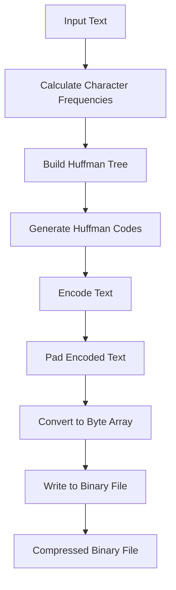

# Huffman Coding Compression and Decompression
 
## Overview

 This project demonstrates file compression and decompression using the          Huffman Coding algorithm in Python. Huffman Coding is a lossless data           compression technique that reduces file size by assigning shorter binary        codes to frequently occurring characters.

## Features

● <b>Compression</b>: Compresses a text file using the Huffman coding algorithm.
 
● <b>Decompression</b>: Decompresses the compressed binary file back to its original text format.

## How it works

### Compression

  1. Reads the input text file to be compressed.
  2. Calculates the frequency of each character in the text.
  3. Builds a Huffman tree based on character frequencies.
  4. Generates Huffman codes for each character.
  5. Encodes the input text using the generated Huffman codes.
  6. Pads the encoded text to ensure its length is a multiple of 8.
  7. Converts the padded binary text into a byte array.
  8. Writes the byte array into a binary file.

### Decompression

  1. Reads the compressed binary file.
  2. Converts the binary file into a bit string.
  3. Removes padding from the bit string.
  4. Decodes the bit string using the Huffman tree.
  5. Writes the decoded text into an output text file.

## Usage

   1. Open and run Huffmancoding.ipynb using Jupyter Notebook.
   2. Enter the path of the text file you wish to compress.
   3. The program will generate a compressed binary file with extension .bin.
   4. The program will also decompress the .bin file and create a                    _decompressed.txt file with the original content.

## Example

  Consider a file named input.txt with the text "hello world":

   1. Run the program and input the path of input.txt.
   2. The program will compress input.txt into input.bin.
   3. It will also generate input_decompressed.txt from the compressed .bin           file.
   4. The content of input_decompressed.txt will be identical to the original,        "hello world".

## Flowchart

### Compression Process

